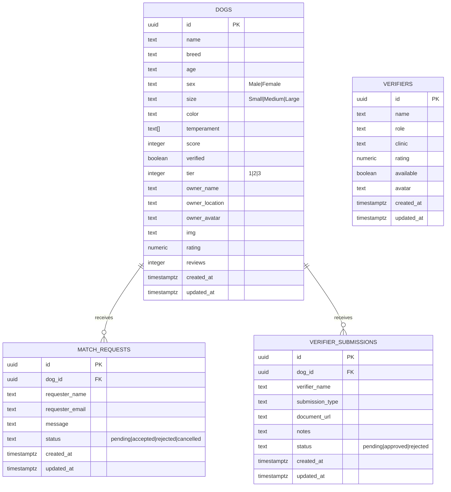
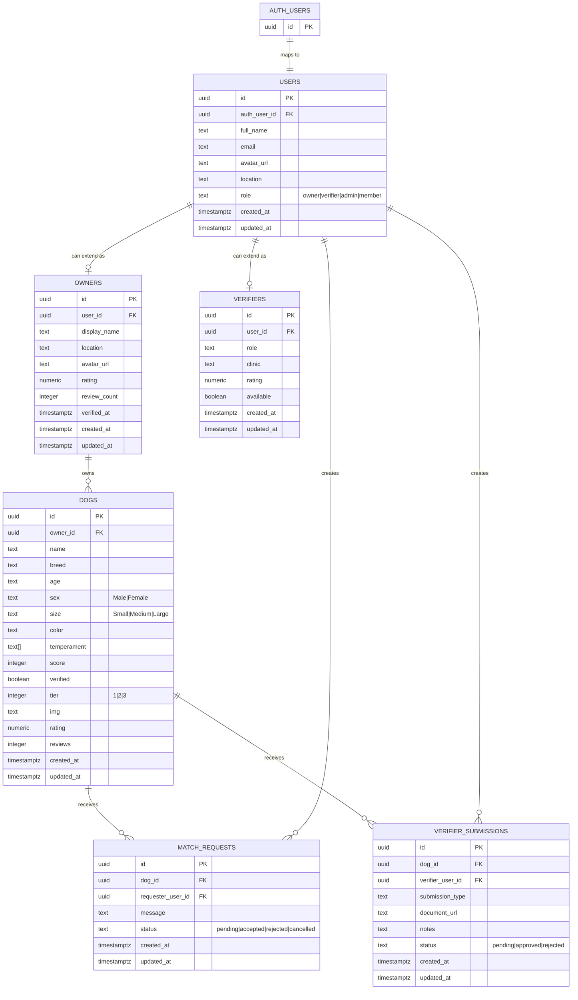

# PawMatch Database ERD

This file shows the current Supabase schema and a normalized target design for users and owners.

Supabase Auth is used for identity either way; the normalized design adds local profile tables instead of storing owner data on the dog rows.

## Current Schema

This is the schema that exists today in `supabase/schema.sql`.

## Relationship Summary

- `dogs` is the main catalog table for dog profiles.
- `verifiers` is a standalone catalog of people or organizations that can verify dogs.
- `match_requests.dog_id` references `dogs.id` and uses `ON DELETE CASCADE`.
- `verifier_submissions.dog_id` references `dogs.id` and uses `ON DELETE CASCADE`.

## Notes

- `match_requests` and `verifier_submissions` are write-only from the current app flow; the UI creates rows, but there is no local table for request history or submission review state beyond those records.
- `dogs.temperament` is stored as a Postgres array, not a separate join table.
- `sex`, `size`, `tier`, and `status` fields are constrained with enums/checks at the database layer.
- Row-level security is enabled on all four tables.

## Normalized Target

This version separates identity, owner profile data, and dog ownership.

### Normalized Design Notes

- `users` becomes the canonical app profile table linked 1:1 to `auth.users`.
- `owners` stores owner-specific fields such as display name, location, avatar, and reputation.
- `dogs.owner_id` replaces `owner_name`, `owner_location`, and `owner_avatar` on the dog row.
- `match_requests.requester_user_id` replaces `requester_name` and `requester_email` as stored columns.
- `verifier_submissions.verifier_user_id` replaces `verifier_name`.
- `verifiers` becomes a role extension table only if verifier-specific attributes are needed beyond the shared user profile.

### Suggested Constraint Set

- `users.auth_user_id` should be unique and reference `auth.users(id)` with `ON DELETE CASCADE`.
- `owners.user_id` should be unique and reference `users(id)` with `ON DELETE CASCADE`.
- `verifiers.user_id` should be unique and reference `users(id)` with `ON DELETE CASCADE`.
- `dogs.owner_id`, `match_requests.requester_user_id`, and `verifier_submissions.verifier_user_id` should all be foreign keys to the normalized tables.

### Migration Impact

- The current app already reads `full_name`, `location`, and avatar data from Supabase auth metadata, so those values can seed `users` during migration.
- Existing dog rows would need owner rows created first, then `dogs.owner_id` backfilled before dropping the embedded owner columns.
- Request and submission history can be migrated without losing structure because those tables already have the correct relationship to `dogs`.
